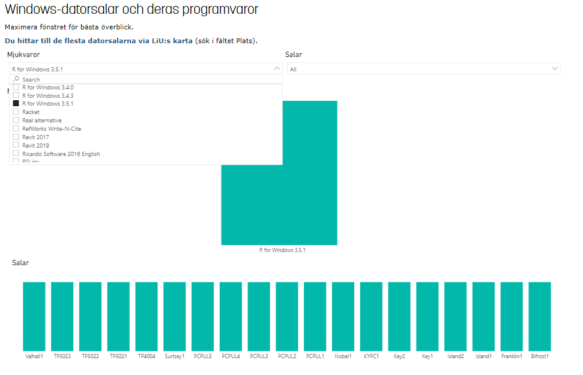

```{r setup, include=FALSE}
knitr::opts_chunk$set(echo = TRUE)
```

\tableofcontents 

\newpage

# Ladda ned R-Commander 

## Windows

* Windows hittar du installation filen för R [**här**](https://cran.r-project.org/bin/windows/base/).

## Mac

Mac har en lite mer kompliserad installation. 

* **OBS!** Jag har ingen mac och rekommenderar att ni kollar denna vidieo för att installera R-commander 
på din dator [**Youtube**](https://www.youtube.com/watch?v=M1PVmz3_W5E&ab_channel=stats250), men installera 
inte *R-3.6.3.pkg* då R-Commander inte fungerar den versionen. Annars är stegen väldigt lika 
från windows. 

* Se till att du har XQuartz installerat på din dator, (nyare versioner av Mac includerar inte
detta program). Du finner installationen [**här**](https://www.xquartz.org/)

Följ de stegen som visas i filmen förutom att du väljer **R-3.6.1.pkg**.

* MAC så hittar du installation filen för R [**här**](https://cran.r-project.org/bin/macosx/) 


\newpage

## Linux / Chromebook

Har inte Linux dator så kan tyvärr inte testa detta innan. För er som testat 
detta får gärna rapportera in till mig om det fungerar. 

* Här finner ni instruktioner på engelska [**här**](https://blog.sellorm.com/2018/12/20/installing-r-and-rstudio-on-a-chromebook/)


## Fjärrinloggning

För er som inte lyckats installera R eller inte vill installera på din egen dator R finns det 
ett ytterligare alternativ att använda Liu datorer hemifrån.


### Ansluta till Universitetets datorsalar 

Liu erbjuder möjligheterna att logga in på datorsalarna hemifrån. Jag har själv testat 
detta och det fungerar för mig, hade tyvärr inte tillgång att installera R-Commander 
på Linux datorerna så rekommenderar att ni använder en Windows dator om ni ska ansluta
till Universitetets datorsalar. Du behöver bara installera R-Commander på en dator 
och sen har du det sparat på din användare.




* Vilka datorsalar ni har tillgång till hittar ni [**här**](https://www.student.liu.se/studentstod/itsupport/datorer?l=sv)

* Datasalarna hittar ni [**här**](https://rdpklienter.edu.liu.se/)


## Ladda ned R-studio (ej obligatoriskt)

* [**R-studio**](https://rstudio.com/products/rstudio/download/#download) för er som vill göra mer än vad R-Commander erbjuder.


Har du några problem med installationen kontakta Härje Widing på Teams
eller på mejl harwi937@student.liu.se

\newpage

# Installera R-Commander

Jag har inte tillgång till Mac så kan endast visa hur det ser ut för windows, kolla gärna [**Youtube**](https://www.youtube.com/watch?v=M1PVmz3_W5E&ab_channel=stats250) om du använder Mac.


Öppna **R x64 4.0.3** eller **R x32 4.0.3** om du använder Windows. 


## Alternativ 1: Funkar samma som på Mac

Du skriver i R Console **install.packages("Rcmdr")** var noga att du använder det raka citattecknet och inte kopierar direkt härifrån. 


Det kommer att komma upp en ruta **Secure CRAN mirrors** där du väljer **Sweden (Umeå) [https]**
**(använder du Mac väljer du USA MI)**
och trycker på OK. 

{height=80%}

Det kommer att komma upp en till ruta där du ska trycka Ja!


Tryck sedan Ja igen!


Det kan förekomma att du kan behöva installera yttligare paket därefter detta 
sker i vanliga fall automatiskt och kan ta mellan 3-10 minuter. 


\newpage

## Alternativ 2: Olika namn på menyerna men funkar lika väl på Mac

Kicka på **Packages** $\rightarrow$ **Install package(s)..**


Det kommer att komma upp en ruta **Secure CRAN mirrors** där du väljer **Sweden (Umeå) [https]**
**(använder du Mac väljer du USA MI)**
och trycker på OK. 

{height=80%}

Välj sedan Rcmdr och tryck Ok.


{height=80%}

Det kommer att komma upp en till ruta där du ska trycka Ja!


Tryck sedan Ja igen!


Det kan förekomma att du kan behöva installera yttligare paket därefter detta 
sker i vanliga fall automatiskt och kan ta mellan 3-10 minuter. 


\newpage

# Starta R-Commander

## Alternativ 1: Samma sätt på Mac

Du skriver i R Console **library(Rcmdr)** och tryck enter. 


Det kommer dyka upp att ytteligare paket kommer måsta installeras, tryck Ja. 


Tryck kolla att det stämmer överens med följande, och tryck Ok. 


\newpage

## Alternativ 2: Olika namn på menyerna men funkar även på Mac.

Kicka på **Packages** $\rightarrow$ **Load package..** och välj **Rcmdr** och tryck OK.

{height=80%}

Det kommer dyka upp att ytteligare paket kommer måsta installeras, tryck Ja. 


Tryck kolla att det stämmer överens med följande, och tryck Ok. 


# R-Commander


\newpage

# Vanliga problem


* **Mac** Att använda Mac och R kan strula ibland med uppdateringar av både operativsystem och /eller R paket som inte är anpassat. 

Kontakta ansvarig för datalaborationerna om detta händer då är du troligtvis inte ensam. 

* R-Commander stängdes ned och nu startar det inte.

Detta är troligtvis för att paketet **Rcmdr** redan är aktiverat och du behöver inaktivera paketet 
för att kunna starta om R-Commander. Du kan antingen starta om hela R eller 

skriva **detach("package:Rcmdr", unload=TRUE)** i R Console för att diaktivera paketet och 
sedan startar R-Commander som tidigare. Var noga att du använder det raka citattecknet
och inte kopierar direkt härifrån. 

* Starta R-Commander gick inte och det kom upp massa error koder.

Detta kan vara för att det saknas ett paket som inte installerades av någon anledning. 
testa skriva **install.packages("htmltools")** i konsollen och tryck enter. Var noga att du använder det raka citattecknet
och inte kopierar direkt härifrån. 


Har du några problem med installationen kontakta Härje Widing på Teams
eller på mejl harwi937@student.liu.se


